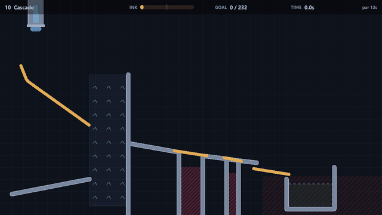
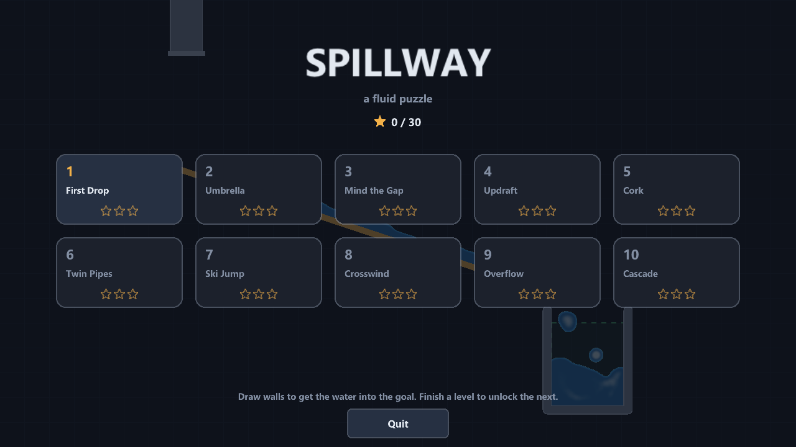
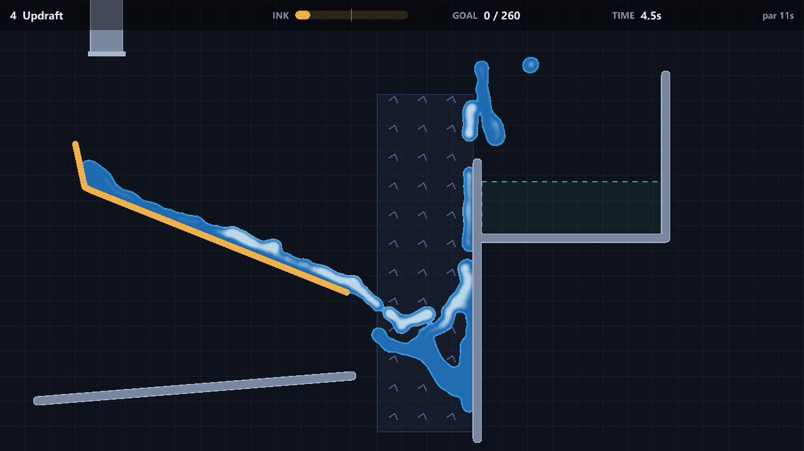
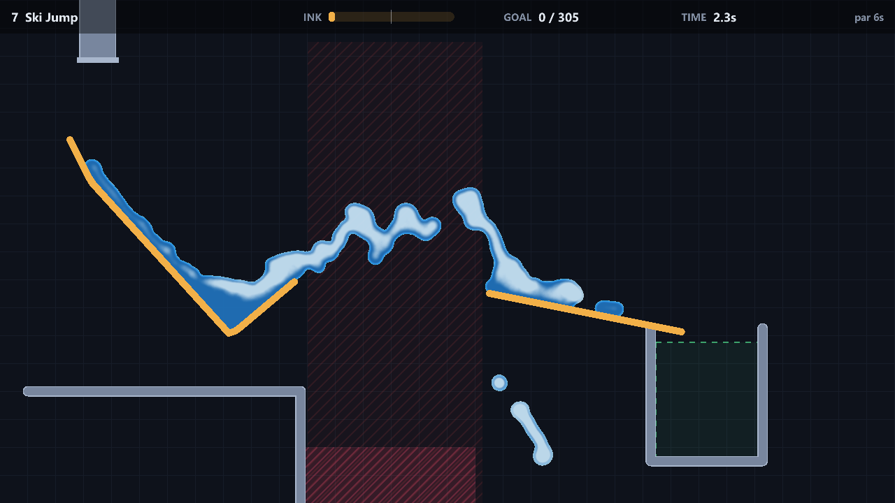
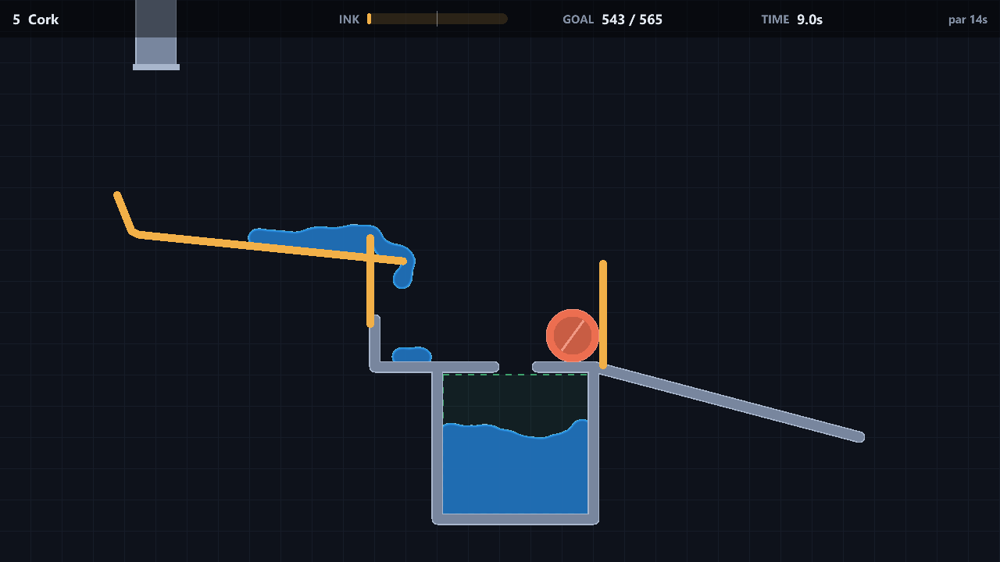

# Spillway

A 2D fluid puzzle game in C++20. Draw walls to guide the water into the goal.
The water is a particle simulation written from scratch. Nothing is scripted:
whatever shape you draw, the water does whatever the physics says it does.



Ten levels, three stars each: fill the goal, use at most half the ink, and
beat par. Along the way you meet fans that lift water up walls, floors with
holes in them, a cork that has to be floated out of a cup, and a chasm you can
only cross by jumping it.

| | |
|---|---|
|  |  |
|  |  |

## Controls

| Input | Action |
|---|---|
| Left mouse | Draw a wall |
| Right mouse | Erase a wall |
| Space | Open the taps / continue |
| Z | Undo the last wall |
| R | Restart |
| Esc / P | Pause |
| F1 | Physics view: raw particles coloured by density, plus solver stats |

## Building

You need CMake 3.20+ and a C++20 compiler. raylib 5.5 is fetched at configure
time, so there is nothing else to install on Windows or macOS. On Linux,
raylib needs the usual X11/GL headers (see `.github/workflows/ci.yml` for the
apt line).

```
cmake -S . -B build -DCMAKE_BUILD_TYPE=Release
cmake --build build --config Release
```

Run `build/spillway` (or `build/Release/spillway.exe` with Visual Studio).
Levels are copied next to the executable on every build.

Tests are a separate binary with no raylib dependency:

```
ctest --test-dir build -C Release --output-on-failure
```

Pass `-DSPILLWAY_BUILD_GAME=OFF` to build only the physics and the tests.

## How the water works

The fluid follows Clavet, Beaudoin and Poulin, *Particle-based Viscoelastic
Fluid Simulation* (SCA 2005), minus the elastic springs. It is a position-based
SPH variant: each step predicts positions from velocities, corrects them for
incompressibility, and then recovers the velocities from how far the particles
actually moved.

Each frame (1/60 s) runs four substeps:

1. **Forces.** Gravity, plus any fan zones, act on velocity.
2. **Predict.** Positions advance by velocity. The old positions are kept.
3. **Neighbours.** Particles are bucketed into a uniform grid with a counting
   sort, so each cell's particles sit next to each other in memory. Each
   particle then checks the 3x3 cells around it and records every pair closer
   than the interaction radius *h*.
4. **Double density relaxation.** For each particle, density
   ρ = Σ(1 − r/h)² and near-density ρⁿ = Σ(1 − r/h)³. Pressure
   P = k(ρ − ρ₀) pulls particles together below rest density (surface
   tension, which is why streams break into droplets) and pushes them apart
   above it. The near term is always repulsive and stops particles clumping.
   Every pair is displaced along its axis by Δt²(P(1 − q) + Pⁿ(1 − q)²).
5. **Collisions.** Walls are capsules found through a static broadphase grid.
   A particle inside one is projected to its surface, and its previous
   position is rewritten so the derived velocity has nothing going into the
   wall and less sliding (friction). If a particle crossed a wall's centre line
   during the step, it goes back to the side it came from, which stops fast
   water tunnelling through thin strokes.
6. **Velocities.** v = (x − x_prev) / Δt, capped for stability.
7. **Viscosity.** Approaching pairs exchange a radial impulse that is linear
   plus quadratic in their closing speed, capped so it never reverses them.

Balls are rigid discs with mass, rotation, restitution and Coulomb friction.
Water and balls are coupled both ways. When a particle hits a disc, its
velocity relative to the moving surface loses the inward part. The disc gets
the equal and opposite impulse, split by effective mass. Buoyancy is never
coded explicitly: it comes out of the fluid pressure pushing on the disc from
below, which is why the cork in level 5 floats and a dense ball sinks. The
test suite checks both.

Things the tests pin down:

- a dam break settles without losing or exploding particles
- doubling the water in a tank doubles its depth (near-incompressibility)
- light discs float and heavy discs sink
- the grid neighbour search matches brute force
- the collider broadphase never misses a wall within reach
- every shipped level is won by its reference solution and **not** won with
  nothing drawn

## Rendering

Drawing the particles as dots looks like sand. Instead, each particle is
splatted as a soft blob into an off-screen texture with additive blending.
Alpha accumulates how much fluid is at each pixel, and red accumulates speed
weighted the same way. A fragment shader then thresholds that field: inside is
water, shaded deeper where the field is dense, whiter where it is fast (foam),
with a bright rim along the surface.

## Layout

```
src/physics   vector maths, grids, fluid solver, rigid discs, contacts, world
src/game      level format, emitters, session rules, saved progress
src/render    metaball fluid renderer and scene drawing (raylib)
src/app       window, screens, HUD, input, capture/record modes
levels        the ten levels as text files (format in levels/README.md)
tests         physics, rules and level tests; no raylib needed
tools         make_gif.py for turning recorded frames into a GIF
```

`src/physics` and `src/game` do not include raylib at all. The game is a thin
layer over a library that can run headless, which is what makes the level
tests possible.

## Making captures

```
spillway --capture 7 2.2 ski_jump.png solved      # one frame, 2.2 s in
spillway --capture menu 5 title.png               # the title screen
spillway --record 10 10.5 frames solved           # 20 fps frame sequence
python tools/make_gif.py frames cascade.gif
```

## License

MIT
